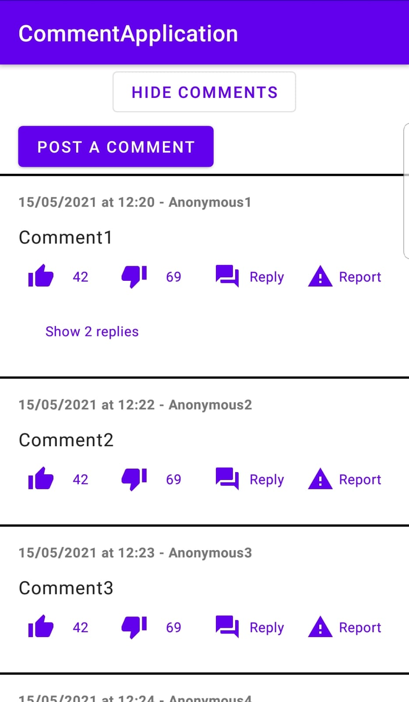

# CommentApplication

Simple application to display 2 depths of comment without extra library.

Disclaimer: There are many string that should be in `strings.xml` and a better way to do some actions.
It's just a small example on how I'd like it to work for me, you should modify if you want a real nested comment